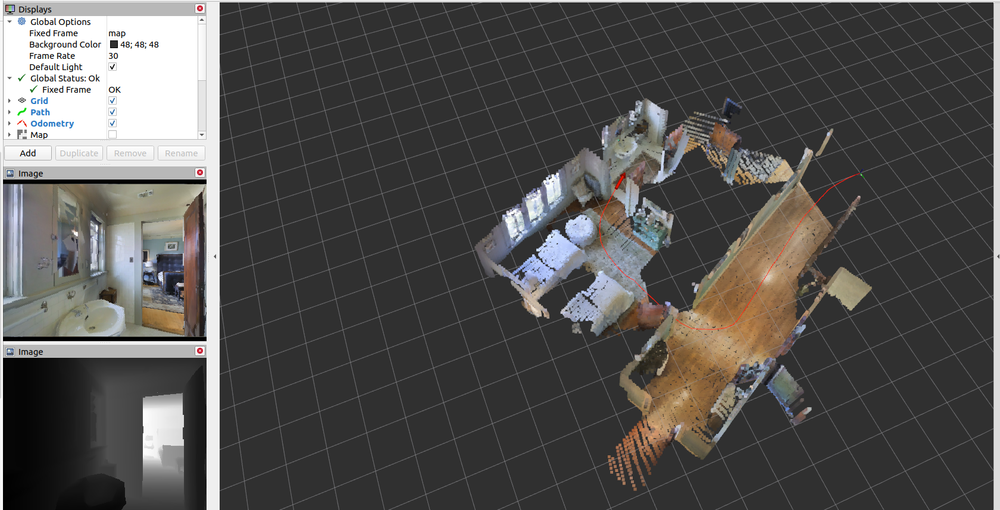

# MAOMaps: Matterport Overlapping Maps Dataset

## Dataset description

MAOMaps is a dataset for evaluation of Visual SLAM, RGB-D SLAM and Map Merging algorithms. It contains 40 samples with RGB and depth images, and ground truth trajectories and maps. These 40 samples are joined into 20 pairs of overlapping maps for map merging methods evaluation. The samples were collected using [Matterport3D](https://niessner.github.io/Matterport/) dataset and [Habitat](https://aihabitat.org/) simulator.

The dataset is available [here](http://pathplanning.ru/public/MAOMaps/).

To use this dataset in your research, please cite the paper: `TBA`.

[](https://youtu.be/3JKfnUo2So8)

### Samples information

| Pair | Trajectory 1 length | Trajectory 2 length | IoU, % | Points 3D | Resolution 2D |
|------|---------------------|---------------------|--------|-----------|---------------|
|   1  |         21.7        |         20.3        | 48     | 405288    | 399x403       |
|   2  |         32.9        |         20.8        | 30     | 493070    | 448x509       | 
|   3  |         13.7        |         15.9        | 62     | 130162    | 234x399       | 
|   4  |         19.0        |         22.9        | 45     | 415810    | 463x419       | 
|   5  |         18.4        |         13.8        | 44     | 175628    | 383x243       | 
|   6  |         16.2        |         21.2        | 40     | 193740    | 444x219       | 
|   7  |         4.1         |         7.8         | 48     | 121247    | 239x236       | 
|   8  |         13.9        |         11.0        | 46     | 163418    | 329x250       |
|   9  |         9.4         |         4.3         | 30     | 88337     | 211x245       | 
|   10 |         9.8         |         10.0        | 40     | 189478    | 250x310       | 
|  11  |         21.5        |         11.2        | 40     | 240041    | 330x379       | 
|  12  |         16.3        |         17.4        | 33     | 397487    | 528x407       | 
|  13  |         22.2        |         21.0        | 54     | 266472    | 329x425       | 
|  14  |         13.9        |         15.8        | 42     | 214593    | 327x484       | 
|  15  |         12.6        |         21.1        | 20     | 277755    | 397x314       | 
|  16  |         21.6        |         17.8        | 27     | 267133    | 400x284       | 
|  17  |         10.8        |         6.5         | 39     | 164773    | 349x238       | 
|  18  |         13.7        |         12.3        | 51     | 156416    | 255x326       | 
|  19  |         15.6        |         14.1        | 42     | 183705    | 228x319       | 
|  20  |         18.9        |         19.9        | 28     | 251173    | 293x465       | 


### Dataset structure

The dataset contains 20 pairs of trajectories. Each pair is stored in its own subdirectory.

Each sample contains:

* `first.bag`, `second.bag` - raw data in Rosbag format for first and second trajectory of the pair. Rosbags contain RGB images (in topic `/habitat/rgb/image`), depth maps (in topic `/habitat/depth/image`), camera info (in topic `/habitat/rgb/camera_info`), and poses (in topic `/true_pose`).

* `gt_points_first.pcd`, `gt_points_second.pcd` - ground truth maps stored as point clouds, for first and second trajectory of the pair.

* `gt_points_first.txt`, `gt_points_second.txt` - ground truth maps coordinates in text format, for first and second trajectory of the pair.

* `gt_points_merged.pcd` - merged ground truth map in Pointcloud format.

* `gt_points_merged.txt` - merged ground truth map points in text format.

* `gt_colors_first.txt`, `gt_colors_second.txt` - colors of points of first and second ground truth map in RGB format.

* `gt_colors_merged.txt` - colors of points of merged ground truth map in RGB format.

* `gt_poses_first.txt`, `gt_poses_second.txt` - ground truth trajectories stores as a set of 6D poses.

* `start_pose_first.txt`, `start_pose_second.txt` - ground truth start positions of first and second trajectory.

## Toolbox

This toolbox contains scripts for VSLAM and Map Merging algorithms evaluation (stored in [evaluate](https://github.com/CnnDepth/MAOMaps/tree/master/evaluate) folder) and scripts for dataset expanding (stored in [collect_data](https://github.com/CnnDepth/MAOMaps/tree/master/collect_data) folder).

### Evaluate

To use this part of toolbox, clone [slam_comparison](https://github.com/CnnDepth/slam_comparison) repo into your ROS workspace and build it:

```bash
cd ~/catkin_ws/src
git clone https://github.com/CnnDepth/slam_comparison
cd ..; catkin_make;
```

**Usage example: estimate RTAB-MAP quality**

1. Open terminal, and run Ros master node:

```bash
roscore
```

2. Open another terminal, and launch the SLAM:

```bash
roslaunch rtabmap_ros rtabmap.launch
```

3. In third terminal, enter the dataset directory, and play some rosbag of the dataset, e.g.

```bash
rosbag play sample1/first.bag
```

4. Create directory to store SLAM pointclouds:

```bash
mkdir sample1/eval_rtabmap
```

5. In fourth terminal, run pointcloud saver:

```bash
rosrun pointcloud_processing pointcloud_subscriber /octomap_occupied_space ./sample1/eval_rtabmap/slam_points.txt ./sample1/eval_rtabmap/slam_colors.txt
```

6. After rosbag stops, and SLAM finishes building map, stop pointcloud saver node in fourth terminal using `Ctrl-C` command

7. Copy groundtruth map and trajectory into SLAM evaluation directory:

```bash
cp sample1/gt_points_first.txt sample1/eval_rtabmap/gt_points.txt
cp sample1/gt_poses_first.txt sample1/eval_rtabmap
```

8. Transform SLAM pointcloud into Habitat coordinate system:

```bash
python evaluate/pointcloud_transformer.py ./sample1/eval_rtabmap/slam_points.txt ./sample1/start_pose_first.txt -0.45
mv sample1/eval_rtabmap/slam_points_transformed.txt sample1/eval_rtabmap/slam_points.txt
```

9. Compute the absolute mapping error of the SLAM:

```bash
rosrun pointcloud_processing octomap_processing ./sample1/eval_rtabmap abs nearest ./sample1/eval_rtabmap/results.txt
```

### Collect_data

To use this part of toolbox, clone [habitat_ros](https://github.com/CnnDepth/habitat_ros) repo into your ROS workspace and build it:

```bash
cd ~/catkin_ws/src
git clone https://github.com/CnnDepth/habitat_ros
cd ..; catkin_make;
```

**Usage example: create 21st sample of the dataset**


1. Open terminal, and run Ros master node:

```bash
roscore
```

2. Open another terminal, and run Habitat keyboard agent:

```bash
roslaunch habitat_ros keyboard_agent.launch
```

3. Create directory `sample21` for new sample:

```bash
mkdir sample21
```

4. In third terminal, record Rosbag from Habitat:

```bash
rosbag record /habitat/rgb/image /habitat/depth/image /habitat/rgb/camera_info /true_pose -O sample21/first.bag
```

5. Move agent through virtual environment using arrow keys on keyboard

6. After end of movement, stop rosbag recording in third terminal using `Ctrl-C` command

7. Play recorded rosbag:

```bash
rosbag play sample21/first.bag
```

8. In fourth terminal, create ground-truth map of the rosbag:

```bash
python collect_data/gt_map_creator.py ./sample21/gt_points_first.txt ./sample21/gt_colors_first.txt 0.0
```

9. In fifth terminal, create ground-truth trajectory of the rosbag:

```bash
python collect_data/gt_path_writer.py ./sample21/gt_poses_first.txt
```

10. After rosbag ends, interrupt ROS loops in fourth and fifth terminal using `Ctrl-C` command.
